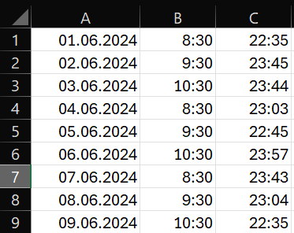
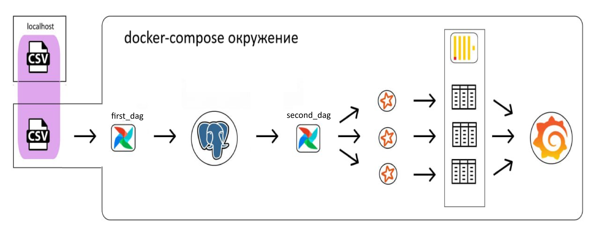
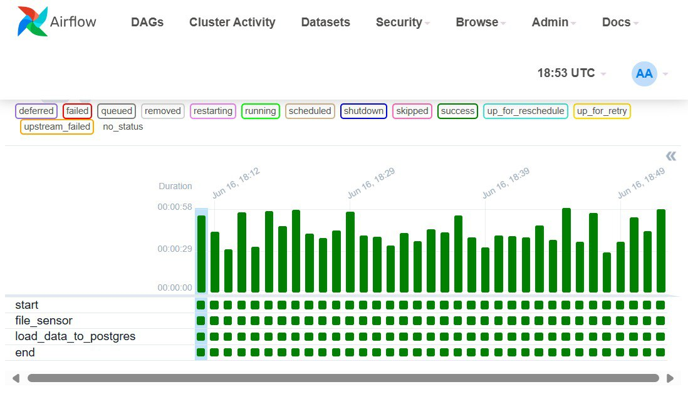
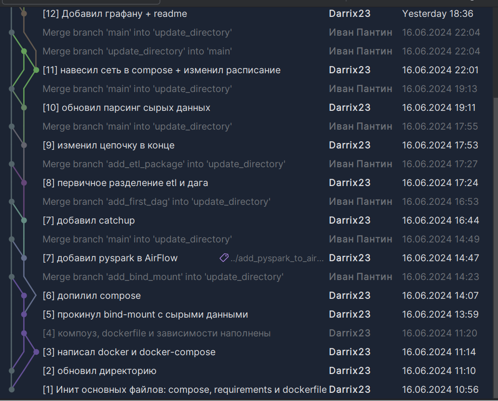

# Документация к проекту

 Решаемая проблема + тонкости MVP

Для демонстрации своих навыков решил смоделировать такую ситуацию. Человек записывает данные о своём сне. Атритбуты записи простые:
- Дата измерения
- Время подъёма
- Время отбоя

Пользователь хочет получить аналитику своих данных, например чтобы оценить динамику изменений своего режима сна

### Цель продукта: предоставить пользователю аналитику его данных "из коробки"==быстро, просто и понятно   

Несколько замечаний:
- Данные не делал сильно разношёрстными, чтобы не усложнять разработку MVP
- Для данного MVP предполагается строгая схема входных данных 

 Архитектура решения

- С локальной машины пользователь пробрасывает bind-mount, содержащий исследуемый csv-файл
- first_dag
  - Его задача: постоянный поиск файла-источника в bind-mount раз в 3 минуты
  - Если csv-файл нашёлся -> можно обновлять данные в postgres (=хранилище сырых данных) 
  - В случае успеха, он совершает update данных в postgres
- Second_dag
  - Его задача это доставка сырых данных в витрины данны (=плацдарм для дашборда)   
  - Он запускается также раз в 3 минуты, и начинается с сенсора:
    - Который показывает, произошли изменения в postgres или нет. Если нет -> дальше даг не пойдёт 
    - Сенсор работает по метаданным postgres: были или нет изменения в базе за последние 3 минуты 
  - Далее идёт таска для извлечения данных из postgres
  

  <<<Отступление: была такая проблема, как обновление витрин на клике, в случае, если сырые данные меняются задним числом. >>>

_______________________________
Работа дага first_dag: 

___________
коммиты исходного репозитория:

